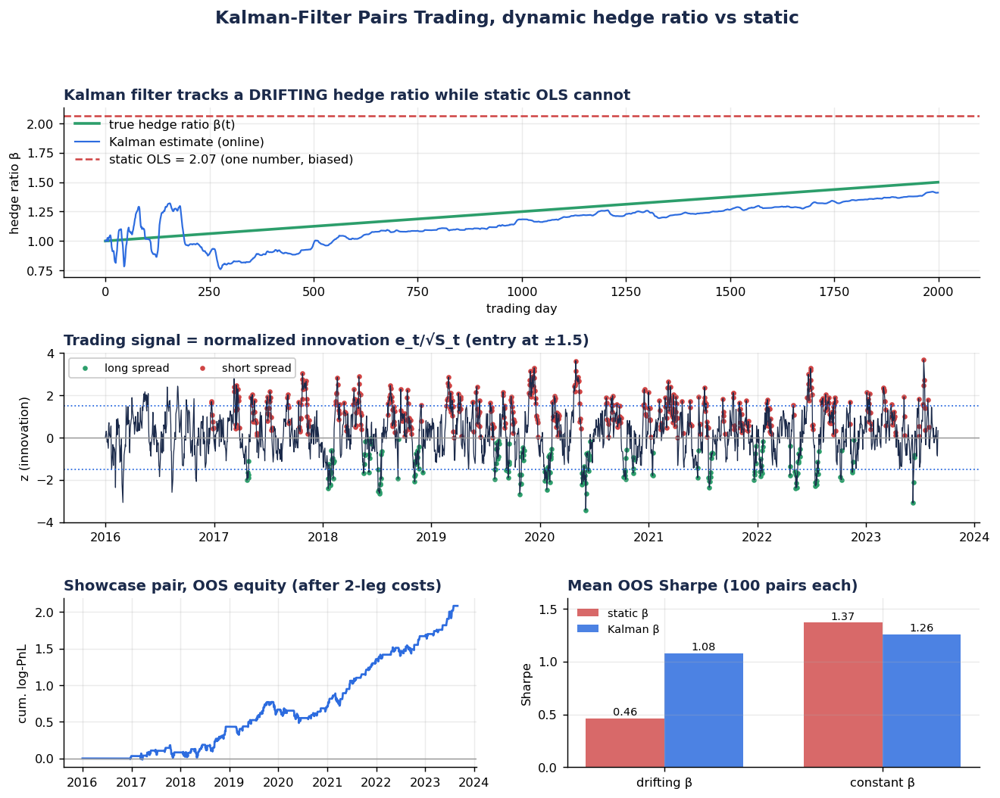
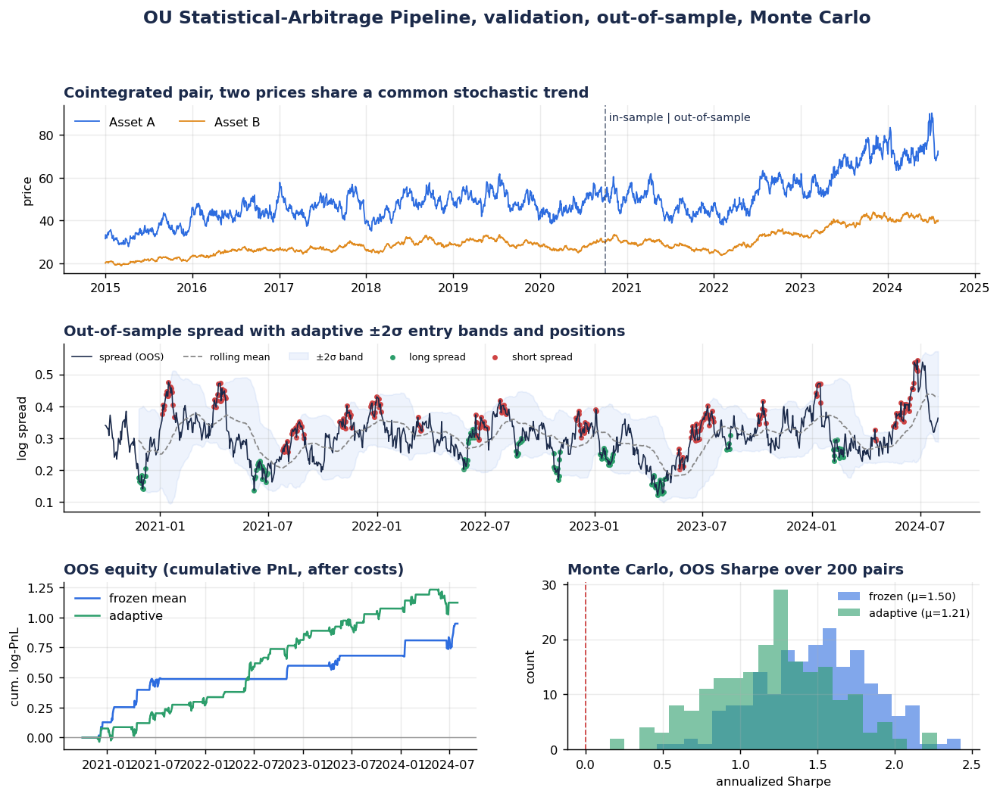
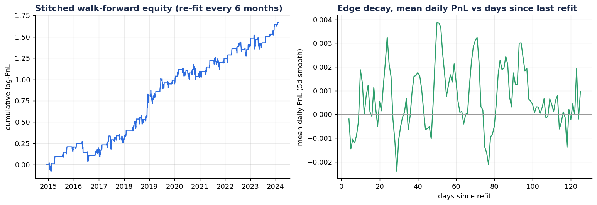
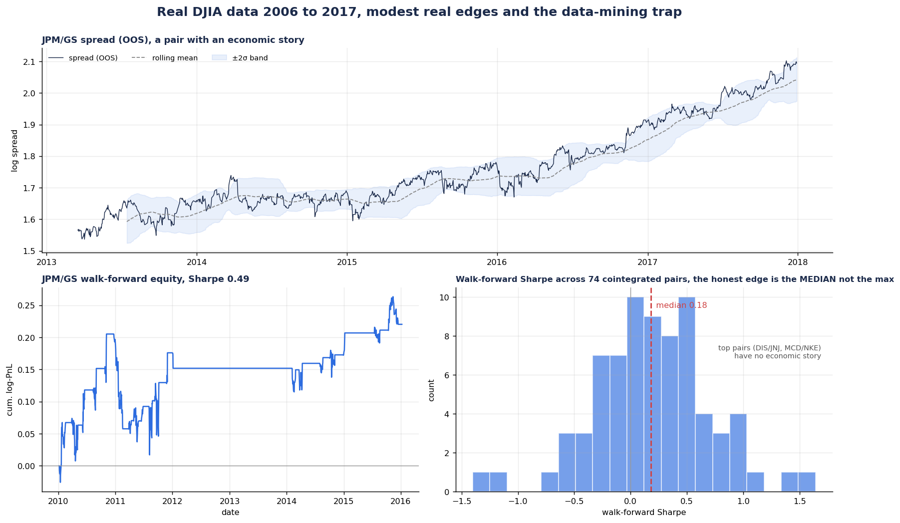
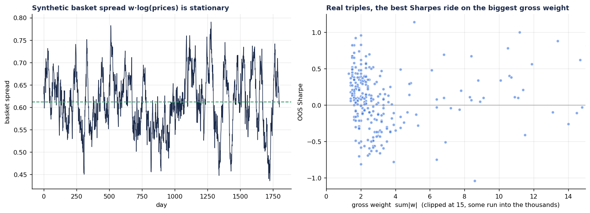
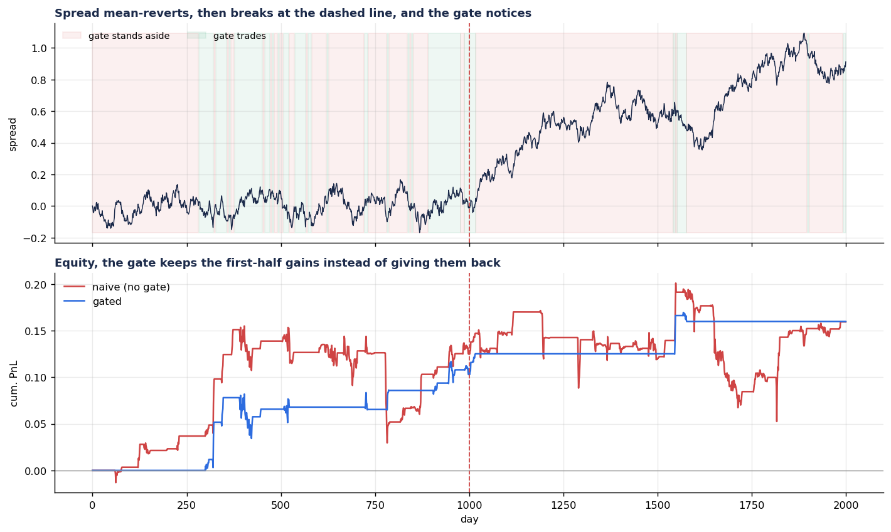
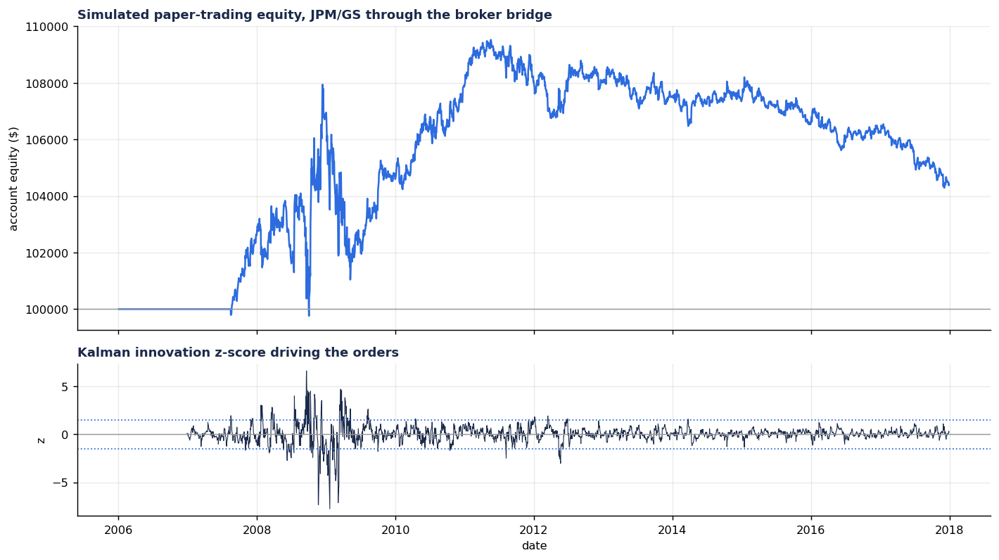

# Ornstein-Uhlenbeck Pairs Trading with a Kalman-Filtered Hedge Ratio

[](https://github.com/NDAR123909/ou-statarb/actions/workflows/ci.yml)
[](LICENSE)
[](pyproject.toml)

This is a pairs-trading research framework built around this borrowed idea from
physics that the spread between two related stocks behaves a lot like a particle on
a spring. Pull it away from rest and a restoring force drags it back. That is the
Ornstein-Uhlenbeck process, written down in 1930 to describe a Brownian particle
sitting in a potential well, and it turns out to be a reasonable model for the
gap between two cointegrated assets.

First off, a very important disclaimer before proceeding with anything else. 
The headline Sharpe numbers below come from synthetic data that I built to be 
cointegrated. They show that the code is correct, not that there is money just 
lying around on the floor to be collected. When I ran the same pipeline on real 
prices, the overall picture became less inflated, which funny enough turned out to be 
the most useful part of the project. I expound more on that further below.

## The one picture to start with

A hedge ratio is not a constant. It drifts as the two companies underneath it
change. A single OLS estimate (red) picks one number and is wrong almost
everywhere. The Kalman filter (blue) re-estimates it every day from past data and
stays close to the truth (green).



## Why a spread might mean-revert

Two companies with similar risk exposures, say two refiners or a stock and its
sector ETF, get pushed around by the same shocks, so they tend to drift together.
The gap between them has no particular reason to run off forever. When it widens,
substitution and arbitrage tend to reel it back in. That pull is the θ in

```
dX = θ(μ − X)dt + σ dW
```

a spring of stiffness θ getting kicked by noise σ. Three useful quantities fall
straight out of it. θ is the reversion speed, basically the inverse of how long
the spring takes to relax. The half-life `ln(2)/θ` is the same expression as
radioactive decay, and I use it to set the lookback window for the z-score.
`σ/√(2θ)` is the resting width of the spread, which is the natural yardstick for
measuring how far it has strayed.

No cointegration means no spring, so the code refuses to trade those pairs.
Checking for the mechanism before betting on it is most of what separates this
from a curve fit.

## What's in the box

| module | what it does |
|---|---|
| `statarb/ou.py` | OU estimation via its exact AR(1) form, the cointegration test, and an event-driven backtester with costs |
| `statarb/kalman.py` | a dynamic-regression Kalman filter for a drifting hedge ratio, plus a two-leg cost-aware backtest |
| `statarb/walkforward.py` | rolling re-fit walk-forward analysis and an edge-decay diagnostic |
| `statarb/johansen.py` | Johansen test and basket spreads for three or more assets |
| `statarb/risk.py` | proportional sizing and a regime gate that stands down when reversion dies |
| `statarb/broker.py` | broker interface, a mock broker for replay, and an Alpaca paper bridge |
| `statarb/selection.py` | **(v0.2)** FDR-corrected, stability-filtered pair selection — the scan that survives its own search |
| `statarb/thresholds.py` | **(v0.2)** cost-aware optimal entry/exit bands from exact OU first-passage times |
| `statarb/costs.py` | **(v0.2)** two-leg trading costs, daily borrow accrual, capacity estimate |
| `statarb/portfolio.py` | **(v0.2)** dollar-based multi-pair walk-forward portfolio with vol targeting, z-stops, and a leverage cap |

**v0.2** upgrades the framework from single-pair research code to a portfolio
engine with the risk controls a live book needs. See
[IMPROVEMENTS.md](IMPROVEMENTS.md) for what changed, why, and the measured
out-of-sample results on real data. Quick start for the new layer:
`python examples/real_data_portfolio.py`.

### The static OU pipeline

The flow is: validate the estimator against known truth, fit on the in-sample
window, freeze the parameters, test out of sample, then run the whole thing over
200 simulated pairs so the headline is a distribution rather than one hopeful
chart.



### Walk-forward and edge decay

A single train/test split is easy to fool. Re-fitting every six months across a
decade is harder to fool, and it lets me ask the question that actually decides
whether something is real: once I re-fit, how long does the edge last before it
rots?



On the synthetic data the single-split Sharpe of about 1.5 falls to roughly 0.9
under walk-forward. That drop is not a letdown. It is the honest number, and the
1.5 was just one flattering window.

## On real data: does it actually make money?

The synthetic runs prove the machinery works. The real question is what happens on
real prices, so `examples/real_data_djia.py` runs the full pipeline on 31 DJIA
names (daily, 2006 to 2017) pulled from a public mirror. The answer is humbling,
which is exactly why I kept it in.



Two things stood out, both worth more than any single Sharpe.

First, most of the "obvious" pairs are not tradeable. Out of ten textbook
candidates across oil, banks, staples, and tech, only the two bank pairs (JPM/GS
and JPM/AXP) passed the cointegration test. Even XOM and CVX, the standard
oil-major example, failed on this data. The pairs that did survive earn a modest
walk-forward Sharpe around 0.5. Believable, not life-changing.

Second, and this is the part I'd want someone to take away: scanning all 465
pairs is a trap. It turns up 74 "cointegrated" ones, but you'd expect about 23 of
those by chance alone, and their median walk-forward Sharpe is only 0.18 with a
third of them losing money out of sample. The best-looking pairs are DIS/JNJ
(Disney and Johnson & Johnson) and MCD/NKE (McDonald's and Nike), which have no
business co-moving at all. Their gorgeous Sharpes are selection bias. Test enough
things and a few will shine by luck. The most impressive backtest in a big scan
is usually the most likely to be fake, and the honest edge is the median near
0.2, not the maximum.

So the truthful answer to "how much does it make" is: a little, on a couple of
pairs that have an actual economic story, unreliably, and well below what the
synthetic demo suggested. And that is before borrow costs and crowding, on
unadjusted prices, all of which push the live number down further.

## Extensions

Three things I added once the core worked, each because the base strategy had an
obvious gap.

### Baskets, via the Johansen test

Pairs are just the two-asset case. With three or more related names there can be
a stationary combination even when no two of them cointegrate on their own. The
Johansen test finds those combinations and hands you the weights as
eigenvectors. On a synthetic system with one planted stationary combination it
recovers both the rank and the weights.



The real-data result is a warning. Scanning every triple in this DJIA set finds
290 cointegrated baskets out of 1140, but their median out-of-sample Sharpe is
0.11, lower than the pairs, and the best-looking ones lean on gross weights of
five to ten times capital. That is leverage the backtest barely charges for.
Baskets are more expressive than pairs and much easier to overfit, so Johansen
earns its keep when you bring it a prior, not when you point it at everything and
grab the top of the list.

### Sizing and a regime gate

The base backtest bets a flat position whenever the z-score clears the band, and
it keeps betting even after a relationship has broken. Two fixes. Proportional
sizing scales the bet with the size of the dislocation, capped so one outlier
can't run the book. The regime gate watches the rolling half-life and ADF
p-value and stands the strategy down when the spring dies.



I tested the gate on the failure it exists for: a spread that mean-reverts for
the first half of the sample and then wanders off as a random walk. The naive
version keeps trading the broken half and hands back its gains. The gated
version notices and steps aside, ending with the same PnL at a third of the
drawdown. It is conservative and gives up some real trades, but that is the trade
I want.

### A paper-trading bridge

The most convincing evidence is a live track record, not another backtest, so I
built a thin broker bridge: a small interface, a MockBroker that replays history
with slippage and commission, and an AlpacaPaperBroker that talks to the paper
endpoint through the same interface. The runner drives the Kalman strategy one
bar at a time with an incremental filter update, so the loop that runs the
simulation is the one that would trade paper.



Replaying JPM/GS through the mock broker is sobering in the useful way. The
idealized backtest liked this pair at Sharpe 0.49, but once you pay slippage on
real fills and stop pretending you can rebalance continuously, the simulated
account makes about four percent over a decade at a Sharpe near 0.15. That gap
between the clean backtest and the friction-aware replay is the whole reason the
bridge exists. Point the runner at AlpacaPaperBroker with paper keys and you get
the same record in real time, with nothing at risk.

## Results at a glance

| experiment | result |
|---|---|
| OU estimator vs known truth | recovers the half-life to within about 5% |
| OU Monte Carlo, 200 pairs | median out-of-sample Sharpe about 1.5, positive in every run |
| Kalman vs static, drifting β | 1.08 vs 0.46 Sharpe; β tracking error 0.12 vs 0.78 |
| Kalman vs static, constant β | 1.26 vs 1.37, so the filter is insurance rather than a free boost |
| walk-forward, re-fit every 6 months | Sharpe about 0.9, well under the single split |
| real DJIA, economic pairs | walk-forward Sharpe about 0.5 |
| real DJIA, full 465-pair scan | median 0.18, a third unprofitable out of sample |
| Johansen baskets, triple scan | median 0.11, high Sharpes ride on heavy leverage |
| regime gate on a broken spread | same PnL as naive at about a third of the drawdown |
| paper-trade replay, JPM/GS | about +4% over a decade, Sharpe near 0.15 after fills |

## Why this isn't slop

The short version is that it tries hard to disprove itself. There's a stated
economic mechanism, and it gets tested with an ADF check before any trade rather
than assumed. The estimators are validated against ground truth before I trust
them on data. Nothing is evaluated on the window it was fit on; the in-sample fit
is frozen and the walk-forward goes further. Costs and slippage are charged on
every position change, and the Kalman backtest pays for both legs, including the
small daily rebalance as β drifts. Results are reported as distributions instead
of one hand-picked equity curve. And the code is upfront about where it breaks,
with tests covering the parts that are easy to get wrong.

## Quickstart

```bash
git clone <your-repo-url> && cd ou-statarb
pip install -e .                       # makes `statarb` importable

python examples/demo_ou.py             # estimator validation + Monte Carlo
python examples/demo_kalman.py         # drifting vs constant hedge ratio
python examples/demo_walkforward.py    # rolling re-fit + edge decay
python examples/real_data_djia.py      # real DJIA data and the data-mining trap
python examples/demo_basket.py         # Johansen baskets, and why they overfit
python examples/demo_risk.py           # regime gate on a spread that breaks
python examples/paper_trade.py         # replay through the mock broker bridge
pytest                                 # 15 tests, a few seconds
```

To run on real market data of your choice (needs `pip install yfinance`, runs
locally):

```bash
python examples/live_ou.py             # scan pairs, rank by out-of-sample Sharpe
python examples/live_kalman.py         # same, with the Kalman dynamic hedge
```

## Repository layout

```
ou-statarb/
├── statarb/              # the package
│   ├── ou.py             # OU estimation, cointegration, backtest
│   ├── kalman.py         # Kalman dynamic hedge ratio + backtest
│   ├── walkforward.py    # rolling re-fit + edge-decay analysis
│   ├── johansen.py       # basket cointegration (three or more assets)
│   ├── risk.py           # proportional sizing + regime gate
│   └── broker.py         # mock + Alpaca paper-trading bridge
├── examples/             # demos, real-data scanners
├── tests/                # pytest suite
├── figures/              # result plots
├── requirements.txt
├── pyproject.toml
└── LICENSE
```

## The knob that matters: Kalman `delta`

`Q = delta/(1−delta)·I` sets how fast the hedge ratio is allowed to drift, and
there's a genuine tension in picking it. Too large and β chases every little
wiggle, which quietly absorbs the signal you wanted to trade: at `delta = 1e-4`
the innovation broke the entry band only about 1% of the time and the edge just
disappeared. Too small and β can't keep up with real drift. Somewhere around
`1e-7` to `1e-5` works here. Whatever you pick, sweep it, because a real edge
survives the sweep and an artifact won't. There's a test that pins down the
absorption effect so you can see it for yourself.

## What I'd fix before trusting it with a dollar

The synthetic Sharpes come from pairs I built to be cointegrated. Real pairs are
messier, and the classic pairs-trade edge has been crowded for two decades.

The hedge ratio is the soft spot. OLS estimates of it have fat tails (the
spurious-regression problem), and a small error lets the shared trend leak back
into the spread. The Kalman filter helps, but it assumes Gaussian noise and a
smoothly drifting β, and both of those assumptions break on jumps, mergers, and
trading halts.

Mean reversion has a nasty habit: it bets harder exactly as it loses. A widening
spread tells the model to add, right up until the relationship has actually
broken for good. That's the LTCM story in miniature, so size positions with it in
mind.

Costs here are modeled but optimistic. The 5 bps per side ignores borrow cost and
availability on the short leg, market impact, and capacity. Expect live Sharpe
well below backtest. Paper-trade it first, and never put in money you can't
afford to lose.

This is a learning and portfolio project, not financial advice.

## Moving forward

The first round of extensions is now in the repo: Johansen baskets, proportional
sizing with a regime gate, and the paper-trading bridge. What I have not done yet,
roughly in order of how much I think it would matter:

A proper transaction-cost and borrow model, since the paper-trade replay showed
how much the idealized backtest was flattering itself. Intraday data instead of
daily closes, which is where mean-reversion edges actually live once the daily
ones are crowded out. A multiple-testing correction on the pair and basket scans,
so the "best" result comes with an honest p-value rather than a wink. And a small
live dashboard on top of the broker bridge to watch the paper account in real
time.

## License

MIT, see [LICENSE](LICENSE). 
