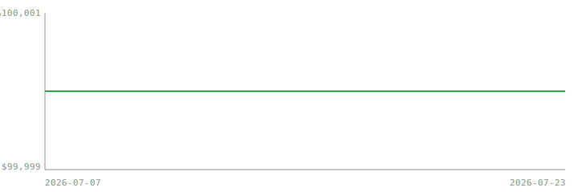

# Live paper-trading track record

_Auto-generated by `deploy/report.py` after each run. Do not edit by hand — changes are overwritten. The authority is the committed data (`equity.csv`, `positions/`, `orders/`) and its git history, not this summary._

**Window:** 2026-07-07 → 2026-07-20 · **10 trading day(s) recorded**

## Summary

| Metric | Value |
| :----- | :---- |
| Current equity | $100,000.00 |
| Total return | +0.00% |
| Max drawdown | 0.00% |
| Live Sharpe (annualized) | n/a (need ≥2 days with equity variation) |
| Current gross leverage | 0.00× |
| Average gross leverage | 0.00× |
| Total fills to date | 0 |

## Backtest vs live

The reference backtest netted **Sharpe ≈ 0.44** (31-name DJIA universe, 2006-2017 OOS, net of costs). That is a weak-but-real edge, and the live result is **expected to land at or below it** — costs, slippage, and the post-close fill lag all subtract. The number worth watching is the *gap*, not the live Sharpe alone, and it is not interpretable until the ~60-day mark.

## How to read this

- **Sharpe is noise below ~60 trading days.** A ratio from a handful of days is dominated by luck; it is flagged as noise above until enough data accumulates.
- **Everything here is out-of-sample.** Parameters were frozen in [`PREREGISTRATION.md`](../PREREGISTRATION.md) before the record began.
- **Borrow is modeled flat at 50 bps/yr**, not per-name — one of the known gaps to weigh when reading the backtest-vs-live gap.
- To audit this record yourself, see [`VERIFY.md`](../VERIFY.md).
